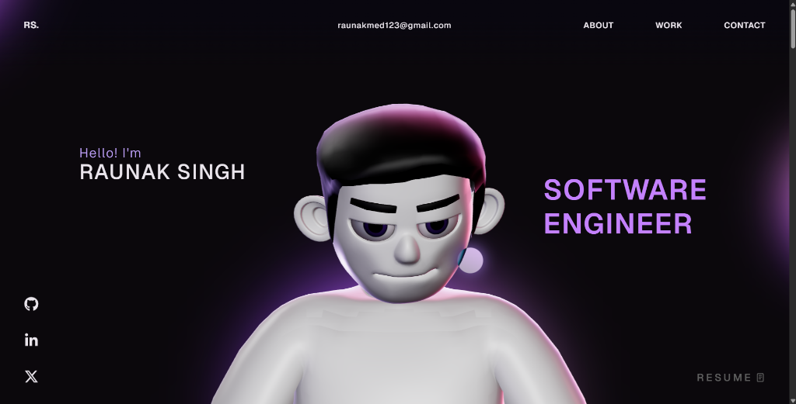

# 🚀 3D Developer Portfolio Website (React + TypeScript + Three.js)

[](https://github.com/raunak0999/portfolio)

A modern, high-performance **3D developer portfolio website** built with **React**, **TypeScript**, **Three.js**, **GSAP**, and **WebGL**.

Interactive, premium developer portfolio tailored for **Raunak Singh** - Full Stack & Intelligent Systems Engineer.

> Live repository: https://github.com/raunak0999/portfolio

---

## ✨ Highlights

- **3D / WebGL experience** powered by **Three.js**
- Smooth scrolling powered by **Lenis** + GSAP ticker synchronization
- Modern **React + TypeScript** codebase
- Fast, responsive UI (fully optimized for desktop + mobile views)
- Custom project showcases linking directly to live GitHub repositories
- Direct interactive resume opening integration

---

## 🧰 Tech Stack

- **React**
- **TypeScript**
- **Three.js / WebGL**
- **GSAP (ScrollTrigger)**
- **Lenis Smooth Scroll**
- **HTML / CSS / JavaScript**

---

## 🚀 Getting Started

### 1) Clone

```bash
git clone https://github.com/raunak0999/portfolio.git
cd portfolio
```

### 2) Install

```bash
npm install
```

### 3) Run locally

```bash
npm run dev
```

### 4) Build

```bash
npm run build
```

---

## 🤝 Connect

- GitHub: https://github.com/raunak0999
- LinkedIn: https://www.linkedin.com/in/raunak-singh-b8ba512b3/
- Email: raunakmed123@gmail.com
- Twitter (X): https://x.com/Raunaksing60556
- LeetCode: https://leetcode.com/u/raunak-/

---

## 🪪 License

This project is open source and available under the **MIT License**. See [LICENSE](LICENSE).
